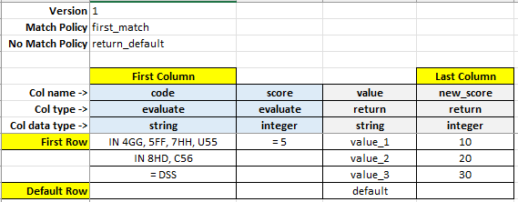

## unify-simple-decision-table

---

Unify Simple Decision Table is a simple and easy to use, Java based implementation of a decision table. Don't let its 
simple and easy to use nature fool you - it is just about as powerful as can be - but thankfully no more!

It provides the following high level functionality:

1. Passing of input data as a map of key value pairs.
2. "First match" and "All Matches" match policies.
3. "Return None" and "Return Default" no match policies.
4. Strict and lenient row validation policies.
5. Multiple data types and evaluation operators.
6. Return contents of multiple columns for one or more matched rows.
7. Call external Java methods for evaluation or return values.
8. Specify JEXL expressions for return values.
9. Raise matched row events for analytics and client specific actions.
10. Pass in any arbitrary input Java object to be used by external Java method for evaluation or return.

This decision table implementation uses sequential rule evaluation. In other words, it evaluates the input data
against the rule rows defined, one at a time, starting from the top. Hence, it is recommended for users
to keep the size of a decision table manageable for performance reasons. We recommend not going beyond a few hundred
rows and a few tens of columns - this also helps in comprehension and keeps things nice, simple and scalable.

Decision tables can be Excel based or JSON based. We recommend JSON based decision tables as they can be stored
as source code and changes tracked. On the other hand, Excel based decision tables are easier to work with
for a non-technical person but the main disadvantage is that you cannot track
changes using a diff tool. One way of working could be to start out with Excel based decision table
and convert the same to JSON based once it has been set up and tested. Of course, once you get comfortable with JSON based tables,
you could work with them directly. We provide a utility to convert an Excel decision table into a 
JSON decision table.

And while you are here, may we invite you to check out a couple of other related offerings which could be of interest:

***Unify-jdocs - a new way of working with JSON documents***

https://github.com/americanexpress/unify-jdocs

This decision table implementation relies on unify-jdocs for all JSON reading and writing requirements.

***Unify-flowret - A lightweight Java based orchestration engine***

https://github.com/americanexpress/unify-flowret

If you like what you see, we would very much appreciate a like - it keeps us motivated knowing that our
work is appreciated and helping people in the community.

### Getting the package
Unify-simple-decision-table is available as a jar file in Maven central with the following Maven coordinates:

```pom
<groupId>com.americanexpress.unify.simple_decision_table</groupId>
<artifactId>unify-simple-decision-table</artifactId>
<version>1.0.0</version>
```

### Prerequisites
Unify-simple-decision-table works with Java 8 and later.

Make sure that log4j configuration file is found in the class path. A sample file is provided in the test resources folder.

### Quick start

```java
// initialize the decision table
DecisionTable.init("my_app", null);

// create a decision table from a JSON file from the resources folder
DecisionTable dt = DecisionTable.fromJson("/decision_table/DTTest1.json");

// create a map of input values to pass into the decision table. The first value specifies the column name in the decision
// table and the second value specifies the input value for that column. Note that it is the client's responsibility to ensure
// that the data passed in matches the data type definition for the column        
Map<String, String> values = new HashMap<>();
values.put("score", "100");
values.put("yob", "1974");
values.put("code", "4GG");

// evaluate the input values against the decision table
List<MatchedRow> list = dt.evaluate(values);

// read the contents of the return rows(s)
System.out.println(list.get(0).get("function").getString());
System.out.println(list.get(0).get("name").getString());
System.out.println(list.get(0).get("value").getInteger());

```

And that is all there is to it.

### Initializing decision tables

A decision table can be initialized by using a `Configurator` object. The configurator can be initialized in a fluent
manner and can be passed to the static `init` method of `DecisionTable`.

```java
public static void init(String systemName, Configuration conf);
```

The parameter `systemName` is an arbitrary application name passed in by clients. Think of it as the application name
in which the decision table implementation runs. This name is also returned to clients as part of the decision event
notification via the `eventHandler`.

The `Configuration` is the configuration object to use for initialization.

The following options can be set using the `Configuration` object.

```java
public Configuration setEventHandler(EventHandler eventHandler)
public Configuration setAllowedClasses(List<Class<?>> allowedClasses)
public Configuration setDefaultRowValidationPolicy(RowValidationPolicy defaultRowValidationPolicy)
```

The `eventHandler` object is a client provided Java object which implements the `EventHandler` interface. The decision
table delivers events to this object and this could be used to generate analytics for decision table usage.

The `allowedClasses` object is a list of classes that are allowed to be used in JEXL scripts across all decision tables.
More details are provided in the section on JEXL expressions later.

The `defaultRowValidationPolicy` object specifies the row validation policy to use while loading the decision table.
This policy is used if there is no row validation policy defined explicitly in the decision table. Please refer to the section
'Row Validation Policy' in the breakdown of decision table below.

Below is an example of how we can use the configurator to initialize the decision table. Note that we need to do this
once at the start of the application.

```Java
Configuration conf = new Configuration()
        .setEventHandler(new TestHandler())
        .setAllowedClasses(Arrays.asList(Integer.class)
        .setDefaultRowValidationPolicy(RowValidationPolicy.STRICT);
DecisionTable.init("Test", conf);
```

Note that the `Configuration` object uses default values to initialize the decision table if any option is not specified. The default values are below:

* NULL for event handler
* NULL for allowedClasses
* STRICT for default row validation policy

### Creating an Excel based decision table

To create an Excel decision table, you can start with the provided template and copy it under a different name.
The template is provided in the main resources folder as `DecisionTableTemplateV1.xlsx`.
Please do not change the text / position of certain yellow highlighted cells as these are markers for the
parser program to read the decision table contents correctly. Note that the column names, number of columns and the
column types are all sample values in the file and can be changed as per requirement.
You can add / delete rows and columns as long as:

1. The first column marker is always in cell B5
2. The last column marker is always in row 5 and after the first column marker
3. The first row marker is always in cell A9
4. The default row marker is always in column A and after the first row marker

Once you have created an Excel decision table, you could store in as a file in your `resources` folder. A couple of
test files are provided - `DTTest1.xlxs` and `DTTest2.xlxs` in the test `resources` folder.

Excel based decision tables are loaded using the method `fromExcel` as below:

```java
DecisionTable dt = DecisionTable.fromExcel("/decision_table/DTTest1.xlsx");
```

### Creating a JSON based decision table

To create a JSON based decision table, one needs to adhere to the structure of a JSON decision table. The same is
provided in the main `resources` folder under the name `decision_table.json`.

JSON based decision tables are loaded using the method `fromJson` as below:

```java
DecisionTable dt = DecisionTable.fromJson("/decision_table/DTTest1.json");
```

Once the decision table is loaded, further steps to work with the decision table in Java code remain the same irrespective
of whether it is an Excel based or a JSON based decision table.

### Break-down of a decision table

Below is a sample JSON based decision table which we will use to explain the various constituents:

```json
{
  "decision_table": {
    "version": "1",
    "match_policy": "first_match",
    "no_match_policy": "return_default",
    "row_validation_policy": "strict",
    "cols": [
      {
        "name": "code",
        "type": "evaluate",
        "data_type": "string"
      },
      {
        "name": "score",
        "type": "evaluate",
        "data_type": "integer"
      },
      {
        "name": "value",
        "type": "return",
        "data_type": "string"
      },
      {
        "name": "new_score",
        "type": "return",
        "data_type": "integer"
      }
    ],
    "rows": [
      {
        "cols": [
          {
            "name": "code",
            "value": "IN 4GG, 5FF, 7HH, U55"
          },
          {
            "name": "score",
            "value": "= 5"
          },
          {
            "name": "value",
            "value": "value_1"
          },
          {
            "name": "new_score",
            "value": "10"
          }
        ]
      },
      {
        "cols": [
           {
              "name": "code",
              "value": "IN 8HD, C56"
           },
           {
              "name": "score",
              "value": ""
           },
           {
              "name": "value",
              "value": "value_2"
           },
           {
              "name": "new_score",
              "value": "20"
           }
        ]
      },
      {
        "cols": [
          {
            "name": "code",
            "value": "= DSS"
          },
          {
            "name": "score",
            "value": null
          },
          {
            "name": "value",
            "value": "value_3"
          },
          {
            "name": "new_score",
            "value": "30"
          }
        ]
      }
    ],
    "default_row": [
      {
        "name": "value",
        "value": "default"
      },
      {
        "name": "new_score",
        "value": null
      }
    ]
  }
}
```

The corresponding Excel based decision table looks like below:



#### Version number

Specifies the version number of the decision table implementation and is found in the JSON path $.decision_table.version.
It is hard coded to 1 at present.

#### Match Policy

Specifies the match policy for the decision table. This field can take on the following values:
1. `first_match` - evaluation returns when the first match is found.
2. `all_matches` - the input is evaluated against all rows and all matching rows are returned.

This field is defined in the JSON path $.decision_table.match_policy.

This field is case-insensitive.

#### No Match Policy

Specifies the behaviour when no matches are found. This field can take on the following values:

1. `return_default` - the contents of the return columns of the default row are returned.
2. `return_none` - no rows are returned.

This field is defined in the JSON path $.decision_table.no_match_policy.

This field is case-insensitive.

#### Row Validation Policy

This defines the validation policy for each row while loading a decision table. It can take on the following values:

1. `strict` - all rows need to have all evaluation columns defined.
2. `lenient` - rows can skip evaluate columns if they are to be ignored.

Note that the row validation policy is only applicable to JSON decision tables. Excel decision tables always follow the strict
validation policy as there is no scope to not specify a value (even if empty) for any evaluation column for any row.

This field is defined in the JSON path $.decision_table.row_validation_policy.

If this field is not defined, the default row validation policy set during initialization of the decision table is used.

This field is case-insensitive.

#### Defining decision table columns

The decision table column definition consists of an array of columns in the path $.decision_table.cols. Each element
in this array defines either an evaluate or a return column type. You can define the evaluate and return column
types in any order, but for better understanding, we recommend to first define all evaluate columns and then all return columns.

#### Column types

Decision table can have the following two types of columns:

1. `evaluate` columns - these are the evaluation columns. The input values passed into the decision table consists of
an input value for each such column. The input values are evaluated against the criteria specified in the cell for the column.
2. `return` columns - these are the columns whose values are returned in case the evaluation columns are matched.

This field is case-insensitive.

#### Column data types

Each column has a data type. The following are the data types which can be assigned to each column.

```java
public enum DataType {
   STRING,
   INTEGER,
   LONG,
   BOOLEAN,
   DOUBLE,
   BIGDECIMAL
}
```

This field is case-insensitive.

#### Defining decision table rows

In a decision table, there could be multiple rows that contain the evaluation criteria against which the input values
are evaluated. These rows are defined in the array $.decision_table.rows. Each element of this array consists
of an array of columns (which correspond to the evaluate and return columns). Each element in the columns array is used to specify
the column name and the evaluation criteria or the return value.

#### Operator types

The operator type must be specified as the starting value in an evaluation cell. For example, if we need to compare the
passed in string value to "America", we will need to specify the following criteria in the evaluation cell:

`= America`

Note above that the first space after the operator is mandatory and is not part of the data.

The following operator types can be specified in the evaluation criteria for each column in the evaluation rows:

```text
  >=
  >
  =
  <
  <=
  <>
  IN
  NOT_IN
  ANY_CONTAINED_IN
  NOT_ANY_CONTAINED_IN
  ALL_CONTAINED_IN
  NOT_ALL_CONTAINED_IN
  CONTAINS_ALL
  NOT_CONTAINS_ALL
  ALL_EQUAL
```
We refer to the values that are passed into the decision table at run time (dynamically) by the program as input values.
The values against which the input values are evaluated i.e. the values specified in the cells of the evaluation
cells in the decision table are referred to as evaluation values.

While interpreting operators, the inputs values are always on the left hand side (LHS) and the evaluation values are
always on the right hand side (RHS). For example, if A is the input value and B is the evaluation value, then LT (<)
operator can be written as:

A < B meaning "is A less than B?"

We will use the above notation to explain the operators below.

#### \>=, >, =, <, <=, <> operators

These operators take in only one input value and specify only one evaluation value. The meaning of the operators is
self-explanatory.

#### IN operator

This operator takes in a single input value and evaluates against multiple evaluation values. The multiple evaluation
values are comma separated. For example:

A IN A, B, C -> will match

D IN A, B, C -> will NOT match

Any spaces after and before the comma are ignored i.e. the evaluation values are trimmed.

Evaluation values are deduplicated at the time of loading the decision table.

#### NOT_IN operator

This is the opposite of IN operator. This will return a match if the input value is not found in the evaluation values.

D NOT_IN A, B, C -> will match

A NOT_IN A, B, C -> will NOT match

Any spaces after and before the comma are ignored i.e. the evaluation values are trimmed.

Evaluation values are deduplicated at the time of loading the decision table.

#### ANY_CONTAINED_IN operator

This operator takes in multiple comma separated input values and evaluates against multiple comma separated evaluation
values.

Input Values ANY_CONTAINED_IN evaluation values - this is to be read as "is any input value contained in evaluation
values?"

It returns a match if any of the input values are found in the evaluation values. For example:

A, B ANY_CONTAINED_IN A, C, D -> will match as A is found

A, C ANY_CONTAINED_IN A, C, D -> will match as A and C are found but it is sufficient for only one to be found

B ANY_CONTAINED_IN A, C, D -> will NOT match as none found

B, E ANY_CONTAINED_IN A, C, D -> will NOT match as none found

Any spaces after and before the comma are ignored i.e. the values are trimmed.

Evaluation values are deduplicated at the time of loading the decision table. Input values are deduplicated before evaluation.

#### NOT_ANY_CONTAINED_IN operator

This operator is the opposite of ANY_CONTAINED_IN operator. It means "is any input value not contained in evaluation
values?". Examples below:

A, B NOT_ANY_CONTAINED_IN A, C, D -> will match as B is not found in evaluation values

B NOT_ANY_CONTAINED_IN A, C, D -> will match as B is not found

B, E NOT_ANY_CONTAINED_IN A, C, D -> will match as B is not found. The fact that E is also not found is irrelevant

A, C NOT_ANY_CONTAINED_IN A, C, D -> will NOT match as both A and C are found

Any spaces after and before the comma are ignored i.e. the values are trimmed.

Evaluation values are deduplicated at the time of loading the decision table. Input values are deduplicated before evaluation.

#### ALL_CONTAINED_IN operator

This operator takes in multiple comma separated input values and evaluates against multiple comma separated evaluation
values.

Input Values ALL_CONTAINED_IN evaluation values - this is to be read as
"are all input values contained in evaluation values?"

It returns a match if all the input values are found in the evaluation values. For example:

A, B ALL_CONTAINED_IN A, B, C, D -> will match as A and B are found in evaluation values

A, B, A, B, A, B, C ALL_CONTAINED_IN A, B, C, D -> will match as all found

A, E ALL_CONTAINED_IN A, B, C, D -> will NOT match as E not found

Any spaces after and before the comma are ignored i.e. the values are trimmed.

Evaluation values are deduplicated at the time of loading the decision table. Input values are deduplicated before evaluation.

#### NOT_ALL_CONTAINED_IN operator

This operator takes in multiple comma separated input values and evaluates against multiple comma separated evaluation
values. This operator is the opposite of ALL_CONTAINED_IN operator.

Input Values NOT_ALL_CONTAINED_IN evaluation values - this is to be read as
"is none of the input values contained in evaluation values?"

It returns a match if none of the input values are found in the evaluation values. For example:

E, F NOT_ALL_CONTAINED_IN A, B, C, D -> will match as E and F both are not found in evaluation values

E, F, E, E, F NOT_ALL_CONTAINED_IN A, B, C, D -> will match as all E and all F are not found in evaluation values

A, B NOT_ALL_CONTAINED_IN A, B, C, D -> will NOT match as A and B are found in evaluation values

A, E NOT_ALL_CONTAINED_IN A, B, C, D -> will NOT match as A is found

Any spaces after and before the comma are ignored i.e. the values are trimmed.

Evaluation values are deduplicated at the time of loading the decision table. Input values are deduplicated before evaluation.

#### CONTAINS_ALL operator

This operator takes in multiple comma separated input values and evaluates against multiple comma separated evaluation
values.

Input Values CONTAINS_ALL evaluation values - this is to be read as
"are all the evaluation values present in the input values?"

It returns a match if all the evaluation values are found in the input values. For example:

A, B, C, D CONTAINS_ALL A, B -> will match as both A and B are found in input values

A, B, C, D CONTAINS_ALL A, A, A, B, B, C -> will match as all are found in input values

A, B, C, D CONTAINS_ALL A, E -> will NOT match as E is not found in input values

Any spaces after and before the comma are ignored i.e. the values are trimmed.

Evaluation values are deduplicated at the time of loading the decision table. Input values are deduplicated before evaluation.

#### NOT_CONTAINS_ALL operator

This operator takes in multiple comma separated input values and evaluates against multiple comma separated evaluation
values. This operator is the opposite of CONTAINS_ALL operator.

This operator is similar to NOT_ALL_CONTAINED_IN operator except that the input and evaluation values are switched.

Any spaces after and before the comma are ignored i.e. the values are trimmed.

Evaluation values are deduplicated at the time of loading the decision table. Input values are deduplicated before evaluation.

#### ALL_EQUAL operator

This operator takes in multiple comma separated input values and evaluates against multiple comma separated evaluation
values.

Input Values ALL_EQUAL evaluation values - this is to be read as
"are all the input values present in the evaluation values and vice versa?"

It returns a match if all input values are present in the evaluation values and vice versa. The order of value on either
side is not important. Values can also repeat on both sides. For example:

B, A ALL_EQUAL A, B -> will match

B, A, B, A ALL_EQUAL A, B -> will match

B, C ALL_EQUAL A, B -> will NOT match as C is not present in evaluation values

A, B ALL_EQUAL C, B -> will NOT match as C is not present in input values

Any spaces after and before the comma are ignored i.e. the values are trimmed.

Evaluation values are deduplicated at the time of loading the decision table. Input values are deduplicated before evaluation.

### A note on NULL and empty values

Please note the following while specifying values in evaluation or return cells:

***For Excel based decision tables:***

For Excel based decision tables, for an evaluation or a return cell, one can ony specify an empty cell and there
is no way to define a NULL value.

An empty evaluation cell is used to specify a don't care condition i.e. ignore evaluation of this cell.

For return cells, if we leave the value as blank in the Excel cell, to clients, it will be returned as NULL for non String
data types and as empty for String data types.

***For JSON based decision tables:***

For JSON based decision tables, it is possible to either specify NULL or an empty string as the value in an evaluation cell
or a return cell.

For evaluation cells, NULL and empty values are treated the same i.e. the evaluation for the cell will be ignored.

For return cells, NULL and empty both are returned as NULL for all non String data types and as empty for all String data types.
The rationale for this is that for non String data types, an empty value has no meaning -
for example, an empty value is not a valid integer, hence a NULL value is returned. For a String data type,
we could have returned NULL or empty as the case may be, but we decided to return empty to ease usage while checking return values and
to have the same behaviour as in an Excel based decision table.

### Validations during decision table loading

Decision tables are validated for correctness when they are loaded (either from JSON or from Excel).

The following conditions are always validated while loading decision tables:

1. No duplicate column names should exist
2. All `rule_id` and `comments` columns must be of String type
3. All values across rows for `rule_id` column must be unique

For JSON based decision tables, additionally, the following conditions are also validated:

1. For decision tables that have `return_default` no match policy, a default row must be defined
2. For decision tables that have `return_none` no match policy, a default row must not be defined
3. Default row, if present, must contain only return columns

### Other features

#### Passing additional data to the decision table

Sometimes, there may be a need to have access to some additional data while evaluating the passed in values. The clients
can pass any Java object as additional input in the `evaluate` method. The `evaluate` method takes on the following signatures:

```java
public List<MatchedRow> evaluate(Map<String, String> values);
public List<MatchedRow> evaluate(Map<String, String> values, Object input);
```

The access to this Java object is only available to the external Java method specified in  evaluation or in return
cells (explained in the next section).

#### Invoking Java code from within decision table

It is possible to specify a method of a class to be executed as the RHS when evaluating the passed in value or
while returning a value for a return column. To use this feature, enter the value of an evaluation or a return cell as "#fully
qualified method path" and define your class to implement this method. Make sure that this class is found
in the classpath. Additionally, the method must have the following signature:

`
Object method_name(Map<String, String> input, Object additionalInput)
`

For example, create a class `TestInvokable` and an execute method in the class and enter
"#com.americanexpress.unify.base.decision_table.TestInvokable.execute" in the evaluation / return cell. If the row is matched, then
the class `TestInvokable` will be instantiated and `execute` method called on the object of this class.
The execute method will receive the map of input values passed to the decision table as well as a custom input object
passed by the client.

Please refer to the method `testInvokable` in the file `DecisionTableTest` in the test folder for a sample.

#### Invoking JEXL script from within decision table

It is possible to invoke a JEXL script for returning a value from the return columns. To invoke a script,
specify the script in the return cell value starting with ?. Each input key is automatically
fed into the JEXL context as a JEXL variable. Note that since we pass all input values as strings, it is left to the client
to convert to appropriate types in the script.

If the script contains any reference to a Java object, then the class for that Java object needs to be explicitly
defined upfront while initializing the decision table as part of the `Configuration` object. This is to ensure
that no arbitrary code execution can take place and that code execution is restricted to the set of Java classes pre-defined
by the application (while initializing the decision table).

For example, we could have a JEXL script as below. In this script, the Java class Long would need to be defined while
initializing the decision table. Also note the use of #pragma while using Java classes in the script. More information on
how to create scripts can be looked up in JEXL documentation.

```jexl
"value": "?#pragma jexl.namespace.Long java.lang.Long; var i = Long:parseLong(yob); return (i + 20);"
```

Please refer to the tests `testJexl`, `testJexl1` and `testJexl2` in the file `DecisionTableTest` for the usage of this
feature.

Decision tables are loaded when they are accessed and have an idle time associated with them. The idle time is the
duration of time for which the decision
table has not been accessed. On idle time expiry, the decision tables are off loaded from system memory. They are
automatically loaded
again when invoked. This helps to conserve system resources.

#### Converting an Excel decision table to JSON

An existing Excel decision table can be converted to a JSON decision table by using the class `ExcelToJson`.

Use the below method to look for Excel decision table files across all folders and its sub folder and convert them to
JSON in one go.

```java
public static List<String> createJsonFiles(String baseDirPath,String filePattern)
```

This method takes in a root folder as the first parameter (for example `c:/folder` without a trailing slash)
and the suffix pattern for Excel files as the second parameter (for example `.xlsx') and traverses
recursively through the folder to look for Excel files to convert. Note RECURSIVELY. The JSON file is created in the
same location
with the Excel file suffix replaced by .json as the suffix. Existing files will be replaced.

Use the below method to convert a single Excel decision table file to JSON.

```java
public static void createJsonFile(String filePath)
```

This method takes in the complete file path of the Excel file to be converted (for example `c:/folder/1.xlsx').
The JSON file is created in the same location with the Excel file suffix replaced by .json as the suffix. Existing files
will be replaced.

#### Converting a JSON decision table to Excel

Decision tables that contain a high number of columns / rows can be difficult to visualize in JSON format. It is
quite helpful if we could view these decision tables in Excel for the purpose of analysis. We can do this by using
the class `JsonToExcel`.

Use the below method to look for JSON decision table files across all folders and its sub folder and convert them to
Excel in one go.

```java
  public static List<String> createExcelFiles(String baseDirPath,String filePattern)
```

This method takes in a root folder as the first parameter (for example `c:/folder` without a trailing slash)
and the suffix pattern for JSON files as the second parameter (for example `.json') and traverses
recursively through the folder to look for JSON files to convert. Note RECURSIVELY. The Excel file is created in the
same location
with the JSON file suffix replaced by .xlsx as the suffix. Existing files will be replaced.

Use the below method to convert a single JSON decision table file to Excel.

```java
  public static void createExcelFile(String filePath)
```

This method takes in the complete file path of the JSON file to be converted (for example `c:/folder/1.json').
The Excel file is created in the same location with the JSON file suffix replaced by .xlsx as the suffix. Existing files
will be replaced.

#### Rules Loaded Event

This event is emitted when the decision table is loaded for the first time. A sample is given below:

```json
{
  "decision_table_event": {
    "system_name": "Test",
    "event_name": "RULES_LOADED",
    "table_name": "/decision_table/name.json",
    "table_size": 2,
    "rules": [
      {
        "rule_id": "rule_1",
        "comments": ""
      },
      {
        "rule_id": "rule_2",
        "comments": ""
      }
    ]
  }
}
```

In the above, table size specifies the number of rows in the table including the default row if present.

The `rules` array specifies, for each row, the values of the columns that have `rule_id` and `comments` type.

If there are no columns with these column types, the 1 index based row number is used as value for `rule_id` and
empty for `comments`.

#### Match Fired Event

This event is emitted for all matches encountered when the decision table is evaluated. A sample is given below:

```json
{
  "decision_table_event": {
    "system_name": "Test",
    "event_name": "MATCH_FIRED",
    "table_name": "/decision_table/name.json",
    "table_size": 2,
    "input": [
      {
        "col_name": "code",
        "col_type": "STRING",
        "value": "4GG"
      },
      {
        "col_name": "score",
        "col_type": "LONG",
        "value": "90"
      },
      {
        "col_name": "yob",
        "col_type": "INTEGER",
        "value": "2014"
      }
    ],
    "result": [
      {
        "rule_id": "rule_default",
        "comments": "",
        "row_num": 1,
        "values": [
          {
            "col_name": "function",
            "col_type": "STRING",
            "value": "foo4"
          },
          {
            "col_name": "name",
            "col_type": "STRING",
            "value": ""
          },
          {
            "col_name": "value",
            "col_type": "INTEGER",
            "value": "4"
          }
        ]
      }
    ]
  }
}
```

In the above, table size specifies the number of rows in the table including the default row if present.

The `input` array specifies the input to the decision table.

The `result` array specifies the details of the row(s) matched. For decision tables that have the no match policy
of return none, for a no match, this block is omitted.

In the `result` array, the following are the fields output:

`rule_id` - specifies the rule id value for the row. If rule id for the row is not specified, 1 index based row number is returned.

`comments` - specifies the comments value for the row.

`row_num` - specifes the 1 index based row number of the matched row.

`values` - an array that specifies the values of the return columns of the matched row. 

While capturing events in the application, it would be worth pointing out, that in heavily used systems, the number
of events generated could be quite high. To address this, the application may need to create an implementation where either:
1) a bounded queue is used to store events awaiting processing - in which case, events arriving at a time when the queue is full
could be ignored
2) or an unbounded queue is used to hold events - which introduces the risk of JVM going out of memory if the load is high and events
are not being processed fast enough
3) or a bounded blocking queue is used if the application is OK to wait till space is available in the queue 

### What next?

Go through the unit test cases in the source code. Unit test cases are available in the location `src/test`

Provide us feedback. We would love to hear from you.

### Author:

Deepak Arora, GitHub: @deepakarora3, Twitter: @DeepakAroraHi

## Contributing

We welcome Your interest in the American Express Open Source Community on Github. Any Contributor to any Open Source
Project managed by the American Express Open Source Community must accept and sign an Agreement indicating agreement to
the terms below. Except for the rights granted in this Agreement to American Express and to recipients of software
distributed by American Express, You reserve all right, title, and interest, if any, in and to Your Contributions.
Please
[fill out the Agreement](https://cla-assistant.io/americanexpress/unify-simple-decision-table).

## License

Any contributions made under this project will be governed by the
[Apache License 2.0](./LICENSE.txt).

## Code of Conduct

This project adheres to the [American Express Community Guidelines](./CODE_OF_CONDUCT.md). By participating, you are
expected to honor these guidelines.
